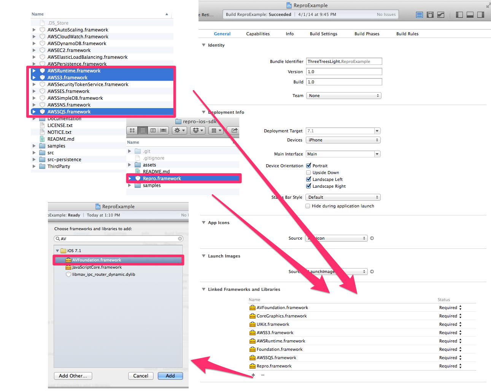
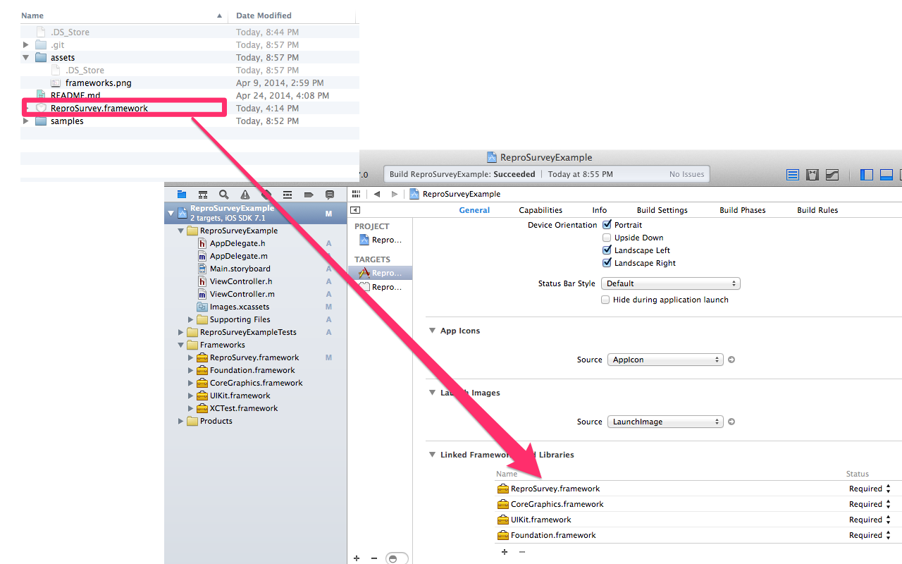
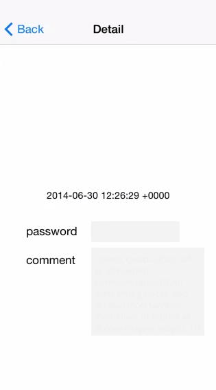

repro-ios-sdk
=============

[](http://cocoadocs.org/docsets/Repro)
[](http://cocoadocs.org/docsets/Repro)


[Repro](https://www.repro.io) provide analytics and reproduce user behavior.

### Insight feature image


### Survey feature image


## Work limitation

If user access with out of limitation device or network,
don't startup "Repro" process only. Not affected.

### Repro SDK version limitation

~> 0.2.3

### Device limitation

Device | Value
------ | -----
iPhone | >= iPhone 5
iPod   | >= iPod Touch 5G
iPad   | >= iPad 4, iPad Air, iPad mini (Retina)

### Network limitation

Network | Work    | annotation
------  | ----    | ----------
~> 3G   | disable | 
4G      | enable  | 
LTE     | enable  | 
Wifi    | enable  | 
3G/LTE  | enable  | When hidden status bar
Unknown | disable | 

## Usage

To run the example project; clone the repo, and run `pod install` from the Example directory first.

## Requirement Frameworks

* AVFoundation.framework
* AWSRuntime.framework
* AWSS3.framework
* AWSSQS.framework
* CoreGraphics.framework
* CoreMedia.framework
* Repro.framework
* UIKit.framework


## Installation with cocoapods

Repro is available through [CocoaPods](http://cocoapods.org), to install
it simply add the following line to your Podfile:

    pod "Repro"

Edge version

    pod "Repro", git: 'git@github.com:reproio/repro-ios-sdk.git'

### Add Script to AppDelegate.m

If you want use Insight, import `<Repro/ReproInsight.h>` and set `application:didFinishLaunchingWithOptions`

```
#import <Repro/ReproInsight.h>

- (BOOL)application:(UIApplication *)application didFinishLaunchingWithOptions:(NSDictionary *)launchOptions
{
    ...
    [ReproInsight setupWithToken:@"YOUR_APP_TOKEN"];
    ...
}
```

If you want use Survey, import `<Repro/ReproSurvey.h>` and set `application:didFinishLaunchingWithOptions`

```
#import <Repro/ReproSurvey.h>

- (BOOL)application:(UIApplication *)application didFinishLaunchingWithOptions:(NSDictionary *)launchOptions
{
    ...
    [ReproInsight setupWithToken:@"YOUR_APP_TOKEN"];
    ...
}
```


## Installation with manual (ReproInsight)

### Download iOS SDK and Unzip

1. Download from [repro-ios-sdk](https://github.com/reproio/repro-ios-sdk/archive/master.zip)
1. Download from [aws-ios-sdk](http://sdk-for-ios.amazonwebservices.com/latest/aws-ios-sdk.zip)

### Add Frameworks

We require framework is

* AVFoundation.framework
* AWSRuntime.framework
* AWSS3.framework
* AWSSQS.framework
* CoreGraphics.framework
* CoreMedia.framework
* Repro.framework
* UIKit.framework

Add AWS, Repro, AVFoundation frameworks



### Set Build Option

Modify Linker Flags

Open `project > BuilSetting > Linking > Other Linker Flags`

add `-Objc -all_load`


### Add Script to AppDelegate.m

Import `<Repro/ReproInsight.h>` and set `application:didFinishLaunchingWithOptions`

```
#import <Repro/ReproInsight.h>

- (BOOL)application:(UIApplication *)application didFinishLaunchingWithOptions:(NSDictionary *)launchOptions
{
    [ReproInsight setupWithToken:@"YOUR_APP_TOKEN"];
}
```

## Installation with manual (ReproSurvey)

### Download iOS SDK and Unzip

Download from [repro-ios-sdk](https://github.com/reproio/repro-ios-sdk/archive/master.zip)

### Add Frameworks

We require these frameworks

* CoreGraphics.framework
* Repro.framework
* UIKit.framework



### Add Script to AppDelegate.m

Import `<Repro/ReproSurvey.h>` and set `application:didFinishLaunchingWithOptions`

```
#import <Repro/ReproSurvey.h>

- (BOOL)application:(UIApplication *)application didFinishLaunchingWithOptions:(NSDictionary *)launchOptions
{
    [ReproSurvey setupWithToken:@"YOUR_APP_TOKEN"];
}
```

# Other Usage

## Masking UIView (ReproInsight)

To protect private contents (like password),
you can mask target UIView like this.



Just call UIView `rpris_masking` instance method

```objc
#import <Repro/ReproInsight.h>

- (void)viewDidLoad
{
    [super viewDidLoad];

    [uiview_object rpris_masking];
}
```

## Add user annotation (ReproInsight)

To send annotation for user recognization,
just call `[ReproInsight setUserAnnotation:(NSString *)useAnnotation]`.

```objc
#import <Repro/ReproInsight.h>

- (void)viewDidLoad
{
    [super viewDidLoad];

    [ReproInsight setUserAnnotation:@"user_id_on_your_service"];
}
```

## Pause / Resume (ReproInsight)

If the app coordinate other application,
you can set pause and resume.

* open safari
* authentication with facebook or twitter


e.g.) authentication facebook app

```objc
#import <Repro/ReproInsight.h>

- (void)authentication_facebook
{
    ...
    [ReproInsight pause];
}

- (void)callback_facebook
{
    [ReproInsight resume];
    ...
}
```

## Author

Repro, Inc.

## License

(c) 2014 Repro Inc.


