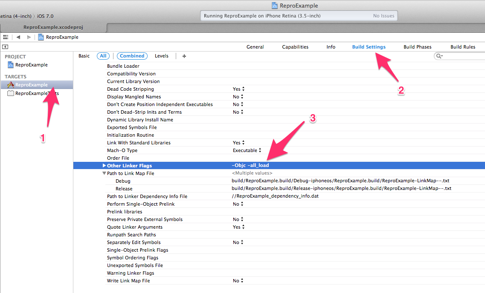

repro-ios-sdk
=============

[](https://gitter.im/reproio/repro-ios-sdk)

Getting Started
---------------

### Download iOS SDK and Unzip

1. Download from [repro-ios-sdk](https://github.com/reproio/repro-ios-sdk/archive/master.zip)
1. Download from [aws-ios-sdk](http://sdk-for-ios.amazonwebservices.com/latest/aws-ios-sdk.zip)

### Add Frameworks

We require these frameworks

* AVFoundation.framework
* AWSRuntime.framework
* AWSS3.framework
* AWSSQS.framework
* CoreGraphics.framework
* CoreMedia.framework
* Repro.framework
* UIKit.framework

Add AWS, Repro, AVFoundation frameworks


### Set Build Option

Modify Linker Flags

Open `project > BuilSetting > Linking > Other Linker Flags`

add `-Objc -all_load`




### Add Script to AppDelegate.m

Import `<Repro/Repro.h>` and set `application:didFinishLaunchingWithOptions`


```
#import <Repro/Repro.h>

...

- (BOOL)application:(UIApplication *)application didFinishLaunchingWithOptions:(NSDictionary *)launchOptions
{

    ...

    [Repro setupReproWithToken:@"YOUR_APP_TOKEN"];

    ...

}
```

Other Usage
-----------

Repro recording process control methods

```
Under writing ...
```
