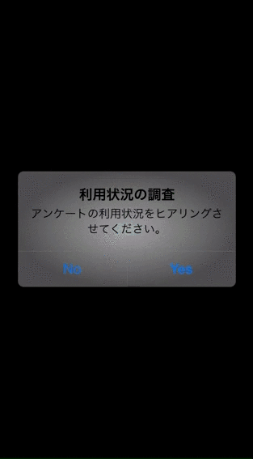

repro-ios-sdk
=============

[](http://cocoadocs.org/docsets/Repro)
[](http://cocoadocs.org/docsets/Repro)

[Repro](https://www.repro.io) provide analytics and reproduce user behavior.

Insight feature image | Survey feature image
--- | ---
 | 

## Work limitation

If user access with out of limitation device or network,
don't startup "Repro" process only. Not affected.

### Repro SDK version limitation

~> 0.2.3

### Device limitation

Device | Value
------ | -----
iPhone | >= iPhone 5
iPod   | >= iPod Touch 5G
iPad   | >= iPad 4, iPad Air, iPad mini (Retina)

### Network limitation

Network | Work    | Annotation
------  | ----    | ----------
~> 3G   | disable | 
4G      | enable  | 
LTE     | enable  | 
Wifi    | enable  | 
3G/LTE  | enable  | When hidden status bar
Unknown | disable | 

## Usage

To run the example project; clone the repo, and run `pod install` from the Example directory first.

## Requirement Frameworks

* AVFoundation.framework
* AWSRuntime.framework
* AWSS3.framework
* AWSSQS.framework
* CoreGraphics.framework
* CoreMedia.framework
* Repro.framework
* UIKit.framework

## Installation with cocoapods

Repro is available through [CocoaPods](http://cocoapods.org), to install
it simply add the following line to your Podfile:

    pod "Repro"

Edge version

    pod "Repro", git: 'git@github.com:reproio/repro-ios-sdk.git'

### Add Script to AppDelegate.m

If you want use Insight, import `<Repro/ReproInsight.h>` and set `application:didFinishLaunchingWithOptions`

```
#import <Repro/ReproInsight.h>

- (BOOL)application:(UIApplication *)application didFinishLaunchingWithOptions:(NSDictionary *)launchOptions
{
    ...
    [ReproInsight setupWithToken:@"YOUR_APP_TOKEN"];
    ...
}
```

If you want use Survey, import `<Repro/ReproSurvey.h>` and set `application:didFinishLaunchingWithOptions`

```
#import <Repro/ReproSurvey.h>

- (BOOL)application:(UIApplication *)application didFinishLaunchingWithOptions:(NSDictionary *)launchOptions
{
    ...
    [ReproInsight setupWithToken:@"YOUR_APP_TOKEN"];
    ...
}
```

## Installation with manual

visit here <http://doc.repro.io>

- [Repro Insight - Manual Install](http://doc.repro.io/en/insight/install_with_manual/)
- [Repro Survey  - Manual Install](http://doc.repro.io/en/survey/install_with_manual/)

# Other Usage

visit here <http://doc.repro.io>

We provide API about

- [Bug reporting](http://doc.repro.io/en/insight/api/)
- [Masking](http://doc.repro.io/en/insight/api/)
  - [Automatic Masking UIView](http://doc.repro.io/en/insight/api/)
  - [Manual Masking Position](http://doc.repro.io/en/insight/api/)
- [Add user annotation](http://doc.repro.io/en/insight/api/)
- [Track custom event](http://doc.repro.io/en/insight/api/)
- [Pause / Resume](http://doc.repro.io/en/insight/api/)

## Author

Repro, Inc.

## License

(c) 2014 Repro Inc.


